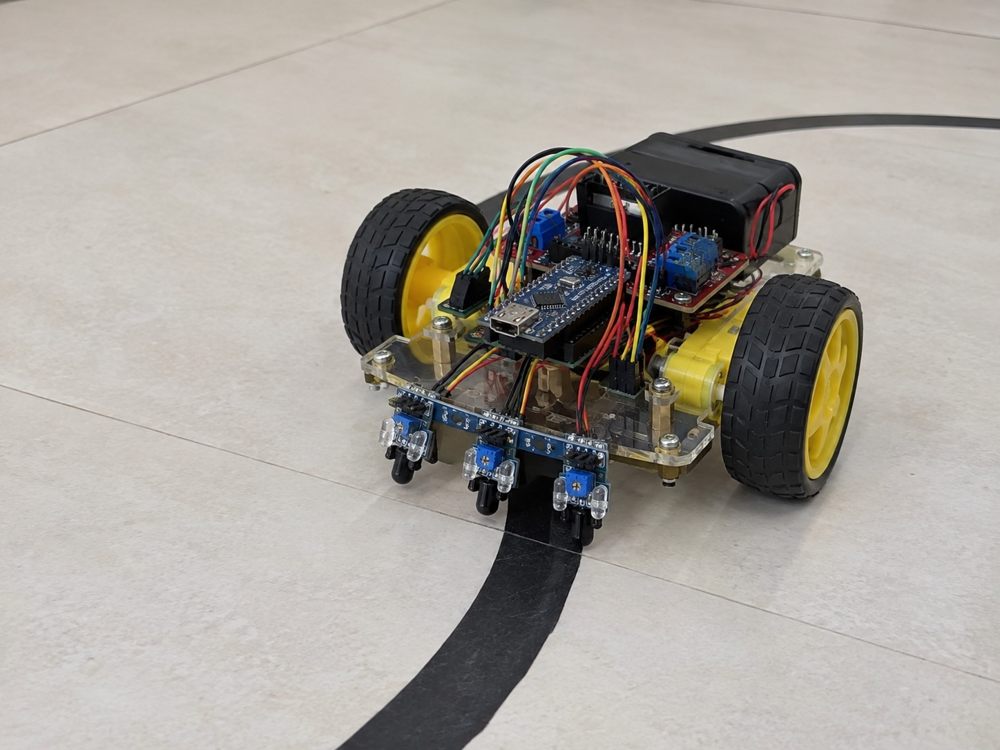

# Arduino Line-Following Robot

An autonomous line-following robot built using **Arduino, 3 IR sensors, and an L298N motor driver**. The robot detects a black line on a white surface and controls the motors to follow the path.

## Features

* 3-IR sensor line detection
* Automatic line following
* Arduino-based control
* L298N dual motor driver
* PWM motor speed control
* Real-time sensor-based motor control

## Hardware Components

* **Microcontroller:** Arduino
* **Sensors:** 3 × IR Line Sensors
* **Motor Driver:** L298N
* **Motors:** 2 × TT DC Gear Motors
* **Wheels:** 2 × Robot Wheels
* **Chassis:** Robot Chassis
* **Power:** Battery / Power Supply
* **Wiring:** Jumper Wires

## Pin Configuration

```text
IR Sensors
Left   → Pin 2
Center → Pin 3
Right  → Pin 4

L298N Motor Driver
ENA → Pin 5
IN1 → Pin 6
IN2 → Pin 7

ENB → Pin 9
IN3 → Pin 10
IN4 → Pin 11
```

## Working

The three IR sensors continuously detect the position of the black line.

The Arduino reads the sensor signals and controls the two motors through the L298N motor driver.

| Sensor Condition        | Robot Action |
| ----------------------- | ------------ |
| Line at center          | Forward      |
| Line on left            | Turn Left    |
| Line on right           | Turn Right   |
| Line lost / end of line | Stop         |

> The exact sensor logic may vary depending on the IR sensor module used.

## Control Logic

```text
Read IR Sensors
       ↓
Detect Line Position
       ↓
Determine Direction
       ↓
Control Motor Driver
       ↓
Move / Turn / Stop
       ↓
Repeat
```

## Software

* **Arduino IDE**
* **Language:** C/C++
* **Control:** Digital GPIO + PWM

## Getting Started

1. Install the **Arduino IDE**.
2. Connect the Arduino board to your computer.
3. Open the line-following robot code.
4. Select the correct Arduino board.
5. Select the correct COM port.
6. Upload the code.
7. Place the robot on a black-line track.
8. Adjust the IR sensor position or motor speed if required.

## Project Image



## Demo Video

https://github.com/user-attachments/assets/34c12653-e1ed-4fb4-b549-167254461754


## Learning Outcomes

* Arduino programming
* IR sensor interfacing
* Digital GPIO control
* PWM motor control
* L298N motor driver interfacing
* Basic robotics and feedback control

## Author

Alkha 
Ayurmithra
